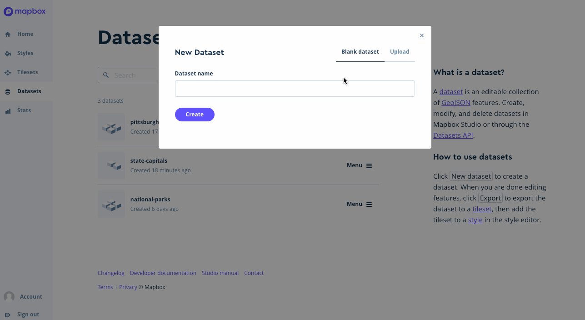
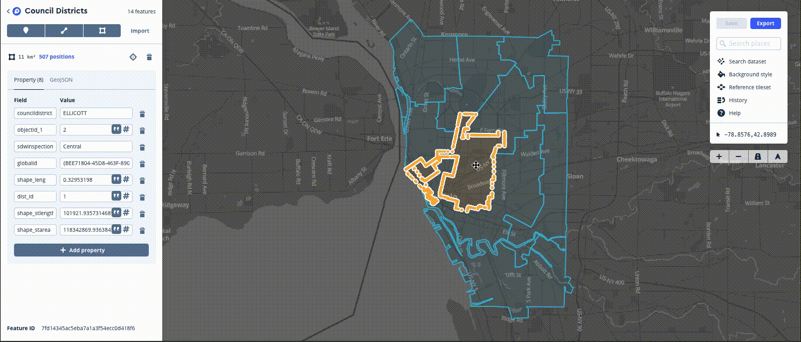
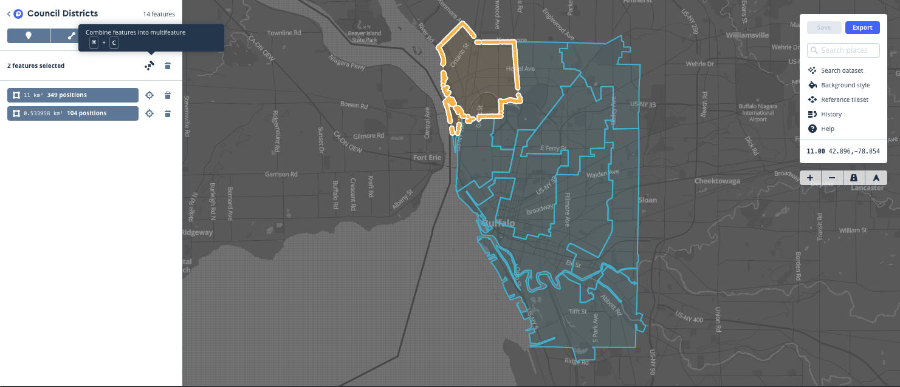

## Mapping rodent incidence by council district 

In this tutorial you will:

* Upload data as a dataset
* Draw & edit data with the dataset editor 
* Create centroid points in QGIS
* Upload data as a tileset 
* [Create a style](https://docs.mapbox.com/help/how-mapbox-works/map-design/#how-map-styles-work) for a basemap.
* [Add data](https://www.mapbox.com/help/uploads/) to a style
* [Manage and edit layers](https://www.mapbox.com/studio-manual/reference/styles/#style-editor) in your style
* Embed a map into a web page

## Software requirements

* Mapbox account
* QGIS
* Text editor 
* GitHub Account

## Data
* [Council District GeoJSON](https://github.com/mjdanielson/University-of-Buffalo/blob/master/Labs/Data/Council%20Districts.geojson)

* [Rodent Incident Table](https://github.com/mjdanielson/University-of-Buffalo/blob/master/Labs/Data/Rodent_Incidence.csv)

## Uploading and editing datasets to Mapbox

You can use the Mapbox Studio [dataset editor](https://studio.mapbox.com/datasets/) to import, create, and edit point, line, and polygon features and their properties. A collection of these features in Mapbox is called a [dataset](https://docs.mapbox.com/help/glossary/dataset/). Datasets can either be downloaded as GeoJSON or exported to tilesets for use in Mapbox styles (see the [Introduction](https://docs.mapbox.com/studio-manual/overview/) section for more information). 

## [What is a dataset?](https://docs.mapbox.com/studio-manual/reference/datasets/#what-is-a-dataset)

A dataset is an editable collection of [GeoJSON](https://www.mapbox.com/help/define-geojson) features. Datasets are distinct from [tilesets](https://www.mapbox.com/help/define-tileset) in that datasets can be edited on a feature-by-feature basis, but cannot be used directly in [Mapbox Studio style editor](https://docs.mapbox.com/studio-manual/reference/styles/#style-editor).

To get started with this tutorial, you will need to go to the [dataset editor](https://studio.mapbox.com/datasets/) in Mapbox Studio and upload your District Council data. 

On your Datasets page, click the __Upload dataset__ button and select the District Council GeoJSON from your local drive. 

Explore your dataset by clicking on different polygons. What property values to see on the left side of the screen? 

Notice that there are multiple polygons with the same name - there are two polygons for district council 'North', two for 'Niagara' amd 4 polygon features for 'Lovejoy'. Before we continue with this exercise, we need to merge our polygon features. Let's start by selecting both of the 'North' district council polygons. Hold down the shift button to select both features at once. With both features selected, click on the __Combine features into multifeature__ button.

Repeat the steps above for both the 'Niagara' and 'Lovejoy' districts (hint: one of the polygons for the Lovejoy district is very small, you may have to zoom in to see it). 

You should now have a single polygon feature for each of the council districts. Next, we will add a new property field to each of our polygons. The new property field will contian information about the incidence of rodents in each district area. The following table contains information on the rodent incidence rate by district: 

| Council District | Incidence Rate |
|------------------|----------------|
| Delaware         | 1950           |
| Ellicott         | 1556           |
| Fillmore         | 2344           |
| Lovejoy          | 2278           |
| Masten           | 2319           |
| Niagara          | 2265           |
| North            | 1912           |
| South            | 2155           |
| University       | 1596           |

Select the 'North' district polygon and select __+ Add Property__ located under the properties panel on the left side of your screen. Add a new property field called __Incidence__ and set the value to 1912 (same as the table above). Select __Confirm__ when you have made this changes. 

Next, select the 'Niagara' district polygon and select __+ Add Property__ located under the properties panel on the left side of your screen. Add a new property field called __Incidence__ (you can set the field name by selecting the 'available field names' pop up) and set the value to 2265 (same as the table above). Select __Confirm__ when you have made this changes. 

Repeat these steps for each council district. 

Once you are finished, select __save__ and return to the [dataset editor homepage](https://studio.mapbox.com/datasets/).

Our final map for this tutorial is going to be a graduated point map of rodent incidence rates by council district. In order to creat this map, we will need to create centroid points for each of the polygon features. We will use QGIS to create the centroid points. 

Download your edited dataset as a GeoJSON by clicking on the  button and selecting download. 

## Create centroid points in QGIS

Open QGIS and add the Council District GeoJSON that you just downloaded as a vector layer to your map. 

Use the __Processing Toolbox__ search bar to find the Vector geometry __Centroids__ tool. This tool creates a new point layer, with points representing the centroid of the geometries in an input layer. Make sure that your __Council_Districts__ layer is selected as the input layer and hit __run__.

  

Right click on the layer and select __Export__ --> __Save Feature As__ and export your file as a GeoJSON. 

We have now successfully created a point feature from our polygon file! There is still one more pre-processing step that we need to do before we can style our data in Mapbox Studio. A common error that occurs when uploading GeoJSON data to Mapbox is that the GeoJSON contains an old-style CRS attribute. To prevent this error, open your GeoJSON in a text editor (for this example, we will be using Atom). Delete the CRS attribute from your code and save your edits. For more information about common data uploading errors check out this helpful [documentation](https://docs.mapbox.com/help/troubleshooting/uploads/).

  

## Upload data as a tileset

In this section, we are going to learn two different ways to create a tileset. 

First, we will learn how to create a tileset by uploading data to the [tileset editor](https://studio.mapbox.com/tilesets/).  At the top of the tileset editor page, select
  . Select __Upload File__ and __Select a file__ and navigate to the file containing your council district centroid GeoJSON and select __Confirm__. 

  

  
  

  
Next, we will create a tileset from an existing dataset. Again, navigate to the top of the tileset editor page and select . Select __Create from Dataset__ and select your __Council Districts___ dataset that we created earlier in this lab.  Select __Export Data__ --> __Export as a new tilesest__ --> __Export__.

 

  
  

When you upload vector data to your Mapbox account, our servers convert it to a [vector tileset](https://docs.mapbox.com/help/glossary/tileset/) so it can be rendered quickly and efficiently in the Mapbox Studio style editor and with Mapbox GL JS. The tileset information page shows some useful information about the tileset that was created from your uploaded data. Feel free to explore the information page for each of your new tilesets. 

  ## Create a style for a basemap
  
After you've inspected your data, it's time to create a new style so you can put it on the map! Go to your [Styles page](https://studio.mapbox.com/). Click the  button. Find the Basic Template style and click .

Excellent! Welcome to the Mapbox Studio style editor. This is where you will create your map style!

Rename the style so that you can find it later. Click into the title field in the upper left side of the screen to change the title from Basic Template to __Graduated_Points__.   button. Find the Basic Template style and click 

   

_You can always refer to the [Mapbox Studio Manual](https://www.mapbox.com/studio-manual/reference/styles/) for more information on getting started._

## [Add data](https://www.mapbox.com/help/uploads/) to a style

To add and style the council district data, you will need to add a new layer to the map. At the top of the layer panel, click .

The editor is now showing your map in “x-ray mode.” X-ray mode shows all the data in the sources added to the style, regardless of whether there is a layer to style it.

In the New layer panel, look in the list of Data sources for the __Council_Districts_Point__ source. Click the tileset and then select the source layer as the source for this new style layer.

The default Basic map view is not centered on Buffalo, New York. Mapbox Studio recognizes that the data you have uploaded is focused on a different location, so it displays the message "This tileset isn't available from your map view." Click __Go to data__, and the map view will refocus on the United States. Zoom to your layer (Buffalo, New York). 

Each layer in Studio can be styled individually by clicking on the name of the layer in the Layer list. There are several layer types to choose from. Each layer type has a unique set of layer properties that can be specified. There are a few options for specifying property values. You can pick values individually, based on a data attribute, based on the zoom level, or the value of another property. For more information on layer types and their styling rules check out this [reference guide](https://docs.mapbox.com/studio-manual/reference/styles/).

## [Manage and edit layers](https://www.mapbox.com/studio-manual/reference/styles/#style-editor) in your style

Click the Style tab and the map will switch back to style mode displaying your new layer. You will see the point data on the map with a default style (black with 100% opacity). Change the name of your data layer to 'Rodent Incidents' and select __radius__ ,  __style across a data range__ and then select the __incidence #__ field.

  

  
In the Mapbox Studio style editor, you can assign a circle radius size based on a numerical attribute field - in this example we will use our rodent incidence rate to assign radius size. Set the __rate of change__ to linear and the __incidence rate__ of 1556 to a __5x__ radius. Lastly, set the __incidence rate__ of 2344 to __10x__ radius. 

           

Play around with some other features for styling this layer. Try changing the color of your points to #8a0505.

Once you are satisfied with how your point data looks, let's add some geographical context to your style by adding a boundary layer for your council districts. To add and style the boundary data, you will need to add a new layer to the map. At the top of the layer panel, click . Navigate and select your __Council Districts__ polygon layer. 

  

Change the color of the layer to 'no color' and adjust the opacity to 75%. 

  

## Publish your style 

Now that you've got your map looking good, it's time to publish! Click the Publish style button at the top of the toolbar on the right side of the screen, then click Publish again on the next prompt.

Hooray! Your style is now published! If you go back to your Styles page, you will see your new style at the top of the list.

You can use your ‘Share URL’ to open your style in a new browser tab and share it with collaborators for review.

